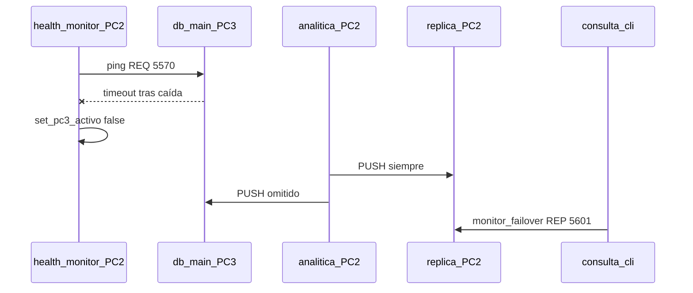

# Explicación técnica — Caso 4: Tolerancia a fallos

## Arquitectura de failover

## Componentes clave

| Archivo | Rol |
|---------|-----|
| `PC2/health_monitor.py` | Ping periódico; 3 fallos → failover |
| `common/pc3_state.py` | Flag global `pc3_activo` |
| `PC2/analitica.py` | `_persistir` solo a principal si activo |
| `PC2/monitor_failover.py` | Mismas operaciones que monitor PC3, lee `replica.db` |
| `PC2/db_replica.py` | SQLite réplica local |
| `scripts/sync_replica_to_principal.py` | Backfill manual al recuperar PC3 |

## Decisiones técnicas

1. **Réplica siempre actualizada** en PC2 (mismo proceso analítica).
2. **Monitor degradado** en puerto distinto (5601) para no colisionar con 5600.
3. **Health check** desacoplado del camino de datos de sensores.
4. Validación en `config_loader` si IPs de PC2 y PC3 coinciden.

## Flujo interno tras caída PC3

1. `health_monitor` deja de recibir `ok` del REP 5570.
2. `set_pc3_activo(False)`.
3. Analítica continúa PUSH a réplica; principal deja de recibir.
4. Cliente redirige REQ a `tcp://pc2_ip:5601`.
5. `monitor_failover` usa `common/monitor_core` sobre `replica.db`.

## Patrones

- **Degradación graceful:** servicio de consulta migrado, no detenido.
- **Estado compartido** en memoria del proceso PC2 (`pc3_state`).

## Riesgos y limitaciones

- No hay reconciliación automática al revivir PC3 (script manual).
- Failover de monitor no replica PC1; si cae PC1, no hay broker alterno.
- `failover_pub_port` (5561) definido en config pero no implementado en código base.

## Mejoras futuras

- Replicación activa de BD principal.
- Elección automática de líder (Raft/consenso).
- Re-sync automático al detectar PC3 recuperado.

## Guión oral

"Cuando PC3 deja de responder al health check, la analítica deja de escribir en la principal pero mantiene la réplica. El operador cambia el puerto del cliente a 5601 en PC2 y verifica que las consultas y los sensores siguen vivos. Cerramos comparando conteos de ambas bases."
